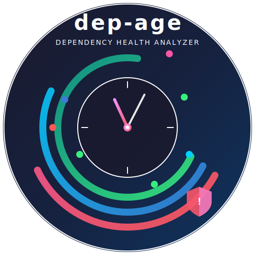

<p align="center">
  
</p>

<h1 align="center">dep-age</h1>

<p align="center">
  <strong>Cross-language dependency age analyzer</strong> — scan lock files &amp; manifests for staleness, CVEs, and update urgency.
</p>

<p align="center">
  <a href="https://github.com/bhayanak/dep-age/actions/workflows/ci.yml"></a>
  <a href="https://codecov.io/gh/dep-age/dep-age"></a>
  <a href="https://pypi.org/project/dep-age/"></a>
  <a href="https://pypi.org/project/dep-age/"></a>
  <a href="https://opensource.org/licenses/MIT"></a>
  <a href="https://github.com/bhayanak/dep-age/releases"></a>
  <a href="https://github.com/bhayanak/dep-age/releases"></a>
</p>

<p align="center">
  One command to answer: <em>"How old and risky are my dependencies?"</em>
</p>

---

## Features

- **6 ecosystems**: npm · pip · gem · go · cargo · composer
- **Lock files + manifests**: scans both resolved lock files and project manifests (`package.json`, `pyproject.toml`, `Cargo.toml`, `go.mod`, `composer.json`)
- **Async parallel** registry lookups with local caching
- **CVE checking** via OSV.dev API
- **Age classification**: Fresh / Aging / Stale
- **Urgency scoring**: None → Critical
- **Health score**: 0–100
- **Multiple outputs**: Rich terminal, JSON, Markdown, CSV, SVG badge
- **CI gating**: `--max-age` and `--max-cves` flags exit non-zero on violations

## Installation

```bash
pip install dep-age
```

## Quick Start

```bash
# Auto-detect lock files in current directory
dep-age scan

# Scan specific file
dep-age scan package-lock.json

# JSON output
dep-age scan --format json --output deps.json

# CI gating: fail if any dep > 2 years or has CVEs
dep-age scan --max-age "2 years" --max-cves 0

# Generate freshness badge
dep-age badge --output dep-badge.svg
```

## CLI Reference

```
dep-age scan [PATH...] [OPTIONS]

Arguments:
  PATH    Lock file(s) or directory to scan (default: current directory)

Options:
  -f, --format TEXT     Output: terminal, json, markdown, csv
  -o, --output TEXT     Write output to file
  --outdated            Show only outdated dependencies
  --cves-only           Show only dependencies with CVEs
  --older-than TEXT     Filter by age (e.g. "1 year", "6 months")
  --max-age TEXT        CI gate: exit 1 if any dep exceeds this age
  --max-cves INT        CI gate: exit 1 if total CVEs exceed this
  --ignore TEXT         Comma-separated packages to skip
  --offline             Use cached data only, no network requests
  -V, --version         Show version
```

## Supported Files

| Ecosystem | Lock Files | Manifest / Config |
|-----------|-----------|-------------------|
| **npm** | `package-lock.json`, `yarn.lock`, `pnpm-lock.yaml` | `package.json` |
| **Python** | `requirements.txt`, `Pipfile.lock`, `poetry.lock` | `pyproject.toml` |
| **Ruby** | `Gemfile.lock` | — |
| **Go** | `go.sum` | `go.mod` |
| **Rust** | `Cargo.lock` | `Cargo.toml` |
| **PHP** | `composer.lock` | `composer.json` |

## what it shows?
Below is **scan of current repo**:
```
$ dep-age scan .
Found 1 lock file(s): pyproject.toml
Parsed 12 dependencies
╭───────────────────────────────────────╮
│ 📦 dep-age · Dependency Health Report │
│ dep-age  ·  Score: 87/100             │
│ 1 ecosystem(s)  ·  12 dependencies    │
╰───────────────────────────────────────╯

                             pip — 12 deps
┏━━━━━━━━━━━━━━━━━┳━━━━━━━━━━━━━┳━━━━━━━━━━━━━┳━━━━━━━┳━━━━━━┳━━━━━━━━━┓
┃ Package         ┃ Current     ┃ Latest      ┃ Age   ┃ CVEs ┃ Urgency ┃
┡━━━━━━━━━━━━━━━━━╇━━━━━━━━━━━━━╇━━━━━━━━━━━━━╇━━━━━━━╇━━━━━━╇━━━━━━━━━┩
│ diskcache       │ 5.6.3       │ 5.6.3       │ 2y 8m │ 1 🟡 │ MEDIUM  │
│ python-dateutil │ 2.9.0.post0 │ 2.9.0.post0 │ 2y 1m │ 0 ✅ │ MEDIUM  │
│ rich            │ 13.9.4      │ 15.0.0      │ 1y 5m │ 0 ✅ │ MEDIUM  │
│ httpx           │ 0.28.1      │ 0.28.1      │ 1y 4m │ 0 ✅ │ LOW     │
│ pyyaml          │ 6.0.3       │ 6.0.3       │ 7m    │ 0 ✅ │ LOW     │
│ pytest-cov      │ 7.1.0       │ 7.1.0       │ 1m    │ 0 ✅ │ NONE    │
│ tomli           │ 2.4.1       │ 2.4.1       │ 1m    │ 0 ✅ │ NONE    │
│ pytest-asyncio  │ 1.4.0a0     │ 1.3.0       │ 1m    │ 0 ✅ │ LOW     │
│ pytest          │ 9.0.3       │ 9.0.3       │ 19d   │ 0 ✅ │ NONE    │
│ respx           │ 0.23.1      │ 0.23.1      │ 18d   │ 0 ✅ │ NONE    │
│ ruff            │ 0.15.12     │ 0.15.12     │ 2d    │ 0 ✅ │ NONE    │
│ typer           │ 0.25.0      │ 0.25.0      │ 1d    │ 0 ✅ │ NONE    │
└─────────────────┴─────────────┴─────────────┴───────┴──────┴─────────┘

Summary:
  📊 Total: 12 deps across 1 ecosystem(s)
  🟢 Fresh (<6 months): 7 (58%)
  🟡 Aging (6m-2y): 3 (25%)
  🔴 Stale (>2 years): 2 (16%)
  🔒 CVEs found: 1 (0 critical, 1 moderate)

💡 Recommendations:
  1. UPDATE IMMEDIATELY: diskcache 5.6.3 → 5.6.3 (1 CVE(s))
  2. Plan update: 2 stale dependencies (>2 years old)
```

## CI Integration

```yaml
# GitHub Actions
- name: Dependency audit
  run: |
    pip install dep-age
    dep-age scan --max-age "2 years" --max-cves 0
```

## Development

```bash
git clone https://github.com/dep-age/dep-age.git
cd dep-age
pip install -e ".[dev]"
ruff check src/ tests/
pytest --cov=dep_age --cov-fail-under=95
```

## License

[MIT](LICENSE)
